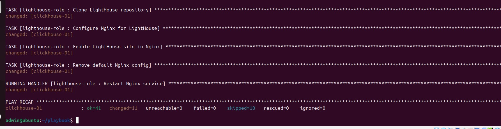
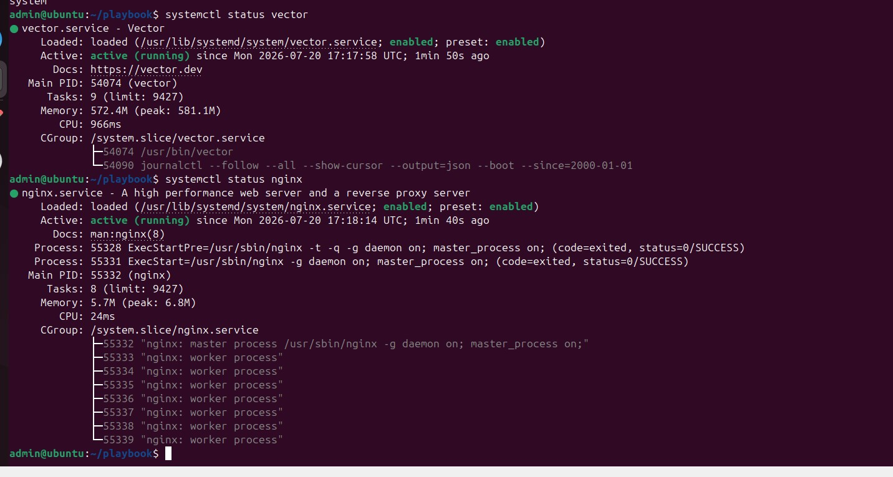

# Домашнее задание к занятию 4 «Работа с roles»

## Используемые внешние роли (Репозитории)

* **Vector Role**: [https://github.com/bukvalni/vector-role](https://github.com/bukvalni/vector-role)
* **Lighthouse Role**: [https://github.com/bukvalni/lighthouse](https://github.com/bukvalni/lighthouse) 

## Проверка

